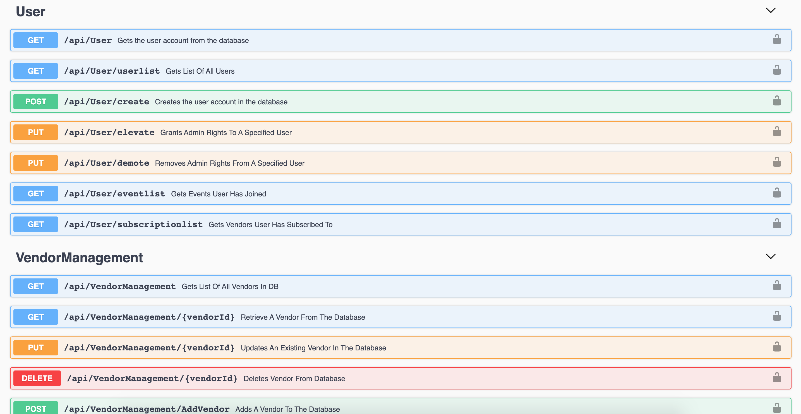

# Industry - SSD
API connecting to .NET Database for mobile and web Atack Marketing applications created by Athena, Tony, Albert, Crystal, Kasra. Copyright 2020.

## Documentation
- Swagger Documentation: [https://atackmarketingapi.azurewebsites.net/index.html](https://atackmarketingapi.azurewebsites.net/index.html)

## Technologies
- .NET Core 3.1
- SQL Server

## API

## What's Next?
- Image storage
